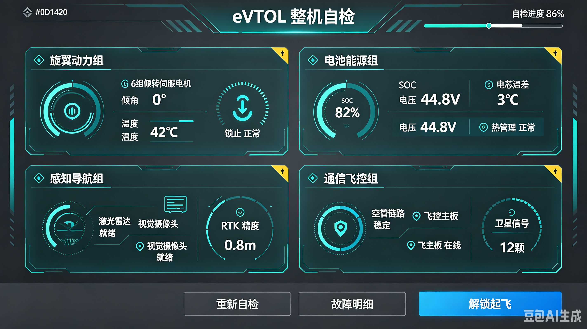
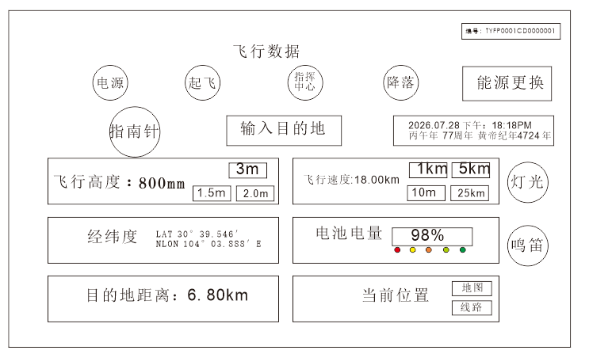

# Qt-PX4 无人机地面站

基于 **C++ / Qt** 开发的 PX4 无人机地面站（Ground Control Station）控制系统。通过 **MAVSDK-C++ v3** 与 PX4 SITL 仿真（或真机）通信，提供飞行控制、实时遥测、地图定位、雷达告警、罗盘航向、电池管理等一体化操控界面，并配套 PX4 + Gazebo + QGC 一键仿真脚本。

## 功能特性

- **飞行控制**：连接 / 断开 PX4（UDP 14540 Companion 端口）、解锁 / 上锁、起飞 / 降落 / 返航、悬停（盘旋 / 前进 / 后退三种模式）、Offboard 位置控制、飞行中动态调整高度、巡航速度限制
- **实时遥测（约 5Hz）**：位置（经纬度、高度）、姿态（滚转 / 俯仰 / 航向）、速度、电池电量、飞行模式、健康状态（陀螺仪 / 加速度计 / 磁力计 / GPS），并统计累计飞行距离与距起飞点距离
- **地图定位**：高德地图（QWebEngine）实时位置标注与轨迹显示、嵌入式位置信息框动态地图、目的地搜索（百度地理编码 + 防抖）与距离计算（Haversine 公式）
- **多策略定位**：Windows 调用 WinRT Geolocation（PowerShell）获取街道级精度，Linux 使用 Qt Positioning GPS，失败自动回退高德 IP 定位
- **自绘仪表控件**：指南针、雷达扫描、旋转角度选择圆盘、悬停模式选择，还原航空仪表交互
- **电池管理**：6 节独立电池实时监控、自动切换与耗尽回充、低电量告警
- **摄像头视频**：OpenCV 采集 USB / 板载摄像头画面（约 30 FPS），降落时自动启动显示
- **科技感 UI**：渐变青蓝配色、霓虹发光面板、背景扫描线动画、自绘科技图标、干支纪年时间显示

## 界面展示

> 以下为界面设计参考图（概念稿），实际界面以运行为准。

| 启动自检 | 飞行数据 |
|---|---|
|  |  |

## 技术架构

```
┌─────────────────────────────────────────────────────────┐
│  UI 层：Qt Widgets（纯代码布局）+ QSS 主题 + 自绘控件     │
│  - 主窗口 / 地图弹窗 / 小地图 / 悬停模式 / 旋转圆盘       │
├─────────────────────────────────────────────────────────┤
│  通信层：Px4Controller（MAVSDK-C++ v3）                  │
│  - QThread 工作线程：所有 MAVSDK 阻塞调用在线程内执行     │
│  - 信号槽投递控制指令，主线程只触发不阻塞                 │
│  - UDP 14540 连接 PX4，遥测约 5Hz 轮询 + 信号回传         │
├─────────────────────────────────────────────────────────┤
│  地图层：QWebEngine 高德 JS API + 百度地理编码            │
│  - 位置信息框嵌入式动态地图（Qt::ToolTip 顶层窗口）        │
├─────────────────────────────────────────────────────────┤
│  数据层：TelemetrySnapshot 遥测快照（跨线程加锁读写）      │
│  - 位置 / 姿态 / 速度 / 电池 / 模式 / 健康状态 / GPS       │
├─────────────────────────────────────────────────────────┤
│  平台适配层：                                            │
│  - Windows：PowerShell + WinRT Geolocation 定位          │
│  - Linux：Qt Positioning GPS + 高德 IP 定位回退          │
│  - 视频：OpenCV（pkg-config opencv4）                   │
└─────────────────────────────────────────────────────────┘
```

### 核心模块

| 模块 | 说明 |
|---|---|
| `widget` | 主窗口：飞行数据面板、控制按钮、电池管理、定位、地图、视频 |
| `px4controller` | PX4 控制器：MAVSDK 封装、工作线程、遥测轮询、高层飞行接口 |
| `compasswidget` | 指南针仪表（自绘） |
| `radarwidget` | 雷达扫描控件（自绘） |
| `rotationdial` | 旋转角度选择圆盘（自绘） |
| `mapdialog` / `minimapdialog` | 高德地图弹窗与目的地小地图 |

## 环境依赖

### Linux（Ubuntu 20.04+）
- Qt 5（`core gui network widgets webenginewidgets`）
- GCC 9+（C++11 / C++17）
- [MAVSDK-C++ v3](https://github.com/mavlink/MAVSDK)（`libmavsdk-dev_3.17.2_ubuntu20.04_amd64.deb`，头文件 `/usr/include/mavsdk`，库 `/usr/lib`）
- OpenCV 4（`sudo apt install libopencv-dev`，经 pkg-config 自动链接）
- 仿真可选：PX4-Autopilot SITL、Gazebo Classic、QGroundControl

### Windows
- Qt 5（MinGW 或 MSVC 工具链）
- OpenCV（配置 `opencv4` 环境）
- PowerShell 5+（WinRT Geolocation 定位）

## 编译与运行

### Linux
```bash
# 1. 安装 MAVSDK-C++ v3（官方 deb 包）
sudo dpkg -i libmavsdk-dev_3.17.2_ubuntu20.04_amd64.deb

# 2. 构建
qmake Qt-PX4.pro
make -j$(nproc)

# 3. 运行（默认自动连接 PX4 SITL udp://:14540）
./Qt-PX4
```

### Windows
用 Qt Creator 直接打开 `Qt-PX4.pro`，选择 MinGW 套件构建运行即可（无需 MAVSDK，仅本地界面与定位功能；连接 PX4 需 Linux 环境）。

## 一键仿真（PX4 SITL + Gazebo + QGC）

项目内置 `run_simulation.sh`，可一键拉起完整仿真环境：

```bash
./run_simulation.sh           # 启动全部（PX4 SITL + Gazebo Classic + QGC）
./run_simulation.sh px4       # 仅启动 PX4 SITL + Gazebo
./run_simulation.sh qgc       # 仅启动 QGC
./run_simulation.sh stop      # 停止全部
./run_simulation.sh status    # 查看运行状态与端口监听
```

默认飞机模型为 `gazebo-classic_iris` 四旋翼，起飞点默认成都（30.5728, 104.0668），可通过环境变量 `PX4_ROOT`、`QGC_APP`、`AIRFRAME` 覆盖。

### 端口约定

| 端口 | 用途 |
|---|---|
| UDP 14540 | Companion / Offboard 通信（本程序连接） |
| UDP 14550 | Ground Control Station（QGC 连接） |

## 目录结构

```
Qt-PX4/
├── widget.cpp / widget.h        # 主窗口（飞行数据界面）
├── px4controller.cpp/.h        # PX4 控制器（MAVSDK v3 封装 + 工作线程）
├── compasswidget.cpp/.h        # 指南针仪表
├── radarwidget.cpp/.h          # 雷达扫描控件
├── rotationdial.cpp/.h         # 旋转角度圆盘
├── mapdialog.cpp/.h            # 高德地图弹窗
├── minimapdialog.cpp/.h        # 目的地小地图
├── main.cpp                    # 程序入口（全局样式 / WebEngine 软件渲染）
├── amap.html                   # 高德地图页面（嵌入 QWebEngine）
├── map.qml                     # QML 测试页
├── run_simulation.sh           # PX4 + Gazebo + QGC 一键仿真脚本
├── get_location.ps1            # Windows WinRT 定位脚本
├── 启动自检.png / 飞行数据.png  # 界面设计参考图
└── Qt-PX4.pro                  # qmake 工程文件
```

## 说明

- 本项目为个人学习 / 研究用途的 PX4 地面站实现，`amap.html` 中的地图 Key 为占位符，使用前请替换为自己的高德地图 Key
- Linux 版需在真实 PX4 SITL 环境下运行才能体验完整飞行控制功能；Windows 版侧重界面与定位演示
